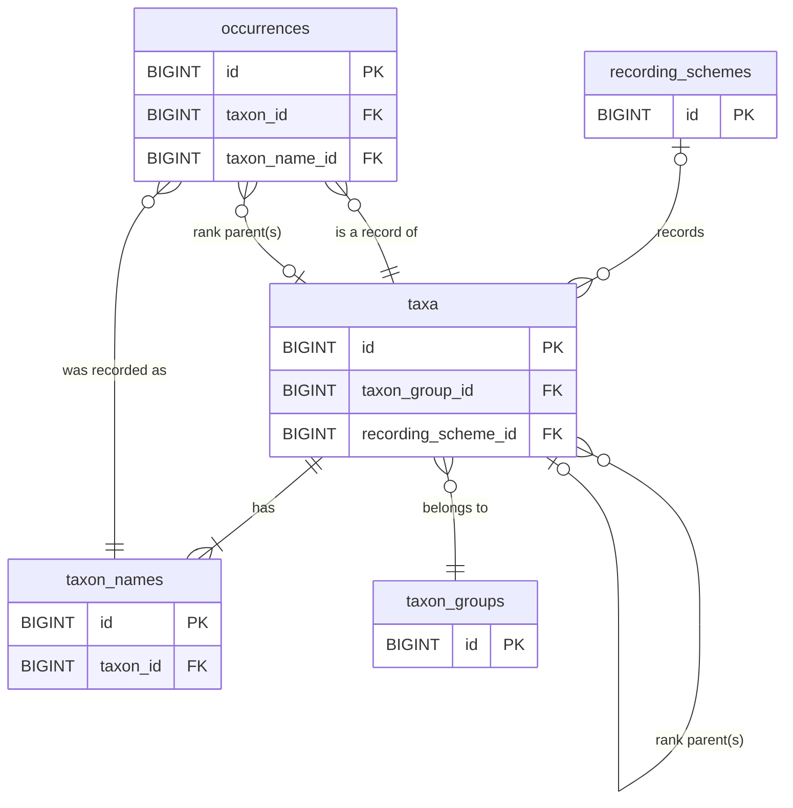

# Database schema

The Tanhub database is an intentionally simplified representation of species
and observation data optimised for reporting outputs rather than accurate
storage of raw data.

The data schema is designed to use Darwin Core standards where possible, with
consideration for importing data from the UKSI species database. Fields that
map directly to a property in the Darwin Core specification are indicated by
DwC followed by the Darwin Core property name.

Each data
entity that is exposed to the API has a unique field associated with it that
is exposed via the API - this will be a Darwin Core field where possible, or
a uuid field is added where using an existing Darwin Core field is not
feasible.

## Entity Relationship Diagram

## Table details

### Dynamic taxon rank foreign keys

Taxonomic hierarchy is stored using dynamic foreign-key columns on both the
`taxa` and `occurrences` tables. During installation, a column is added for
each configured taxon rank using the pattern `<rank>_id` (for example
`kingdom_id`, `class_id`, `family_id`, `order_id`).

Each of these columns is a foreign key to `taxa.id`, so rank relationships are
modelled as self-references to the `taxa` table rather than separate
`orders`, `superfamilies`, or `families` tables.

### taxa

Details of species concepts. May also contain other reportable taxonomic levels
(e.g. aggregates). Taxa are generally imported but species account text may be
added locally. Where a field maps directly to a Darwin Core concept, this is
indicated in the description.

| Column                     | Type         | Null | Key | Default           | Description                                                  |
| -------------------------- | ------------ | ---- | --- | ----------------- | ------------------------------------------------------------ |
| id                         | BIGINT       | NO   | PK  | AUTO_INCREMENT    | Primary key                                                  |
| taxon_identifier           | VARCHAR(100) | NO   | UQ  |                   | Taxon identifier, DwC taxonID, Unique key for the API.       |
| scientific_name_identifier | VARCHAR(100) | NO   |     |                   | Unique identifier of the accepted name, DwC scientificNameID |
| scientific_name            | VARCHAR(200) | NO   |     |                   | Accepted scientific taxon name, DwC scientificName           |
| scientific_name_authorship | VARCHAR(100) | YES  |     |                   | Taxon name author, DwC scientificNameAuthorship              |
| vernacular_name            | VARCHAR(200) | NO   |     |                   | Common taxon name, DwC vernacularName                        |
| <rank>_id                  | BIGINT       | YES  | FK  |                   | Dynamic taxon-rank FK (for each configured rank), references `taxa.id` |
| taxon_group_id             | BIGINT       | NO   | FK  |                   | ID of the taxon reporting group                              |
| id_difficulty              | TINYINT      | YES  |     |                   | Record Cleaner ID difficulty (1-5)                           |
| recording_scheme_id        | BIGINT       | YES  | FK  |                   | ID of the associated recording scheme                        |
| conservation_status        | VARCHAR(10)  | YES  |     |                   | Abbreviation of the taxon's conservation designation         |
| taxon_remarks              | TEXT         | YES  |     |                   | Species account text if provided, DwC taxonRemarks           |
| rarity_group_name          | VARCHAR(100) | NO   |     |                   |                                                              |
| blocked                    | TINYINT(1)   | NO   |     |                   | 1 = species is blocked from searches, 0 otherwise            |
| blocked_reason             | TEXT         | YES  |     |                   | Reason given for blocking the record                         |
| created_at                 | DATETIME     | NO   |     | CURRENT_TIMESTAMP | Creation date                                                |
| updated_at                 | DATETIME     | YES  |     |                   | Update date                                                  |
| deleted_at                 | DATETIME     | YES  |     |                   | Deletion date                                                |

Note that when TanHub is linked to UKSI as its source of taxonomic data, the
following applies:
- taxon_identifier will contain `ORGANISM_KEY`, the UKSI provided unique
  identifier of the organism and unique ID for the API.
- scientific_name_identifier will contain the unique identifier of the accepted
  taxon name, the `TAXON_VERSION_KEY`.
- conservation_status will hold the GB Red List designation's abbreviation,
  e.g. LC or VU.

### taxon_names

Provides a full list of species and other taxon names that are searchable when
finding a concept for reporting. This includes accepted scientific names,
common (vernacular) names and synonyms. Where a field maps directly to a Darwin
Core concept, this is indicated in the description. Note that
scientific_name_identifier is not necessarily unique in this instance as one
name can be attached to more than one taxonomic concept, in this data schema we
duplicate the name records for simplicity as this avoids the need for an
additional join table.

| Column                     | Type         | Null | Key | Default           | Description                                                                      |
| -------------------------- | ------------ | ---- | --- | ----------------- | -------------------------------------------------------------------------------- |
| id                         | BIGINT       | NO   | PK  | AUTO_INCREMENT    | Primary key                                                                      |
| uuid                       | CHAR(36)     | NO   | UQ  |                   | Unique key for the API                                                           |
| taxon_id                   | BIGINT       | NO   | FK  |                   | Foreign key to the taxon this name is associated with                            |
| name                       | VARCHAR(200) | NO   |     |                   | Taxon name, DwC scientificName                                                   |
| scientific_name_identifier | VARCHAR(100) | NO   |     |                   | Unique identifier of the nomenclatural details of the name, DwC scientificNameID |
| accepted                   | TINYINT(1)   | NO   |     |                   | Is name accepted                                                                 |
| scientific                 | TINYINT(1)   | NO   |     |                   | 1=scientific, 0=vernacular                                                       |
| created_at                 | DATETIME     | NO   |     | CURRENT_TIMESTAMP | Creation date                                                                    |
| updated_at                 | DATETIME     | YES  |     |                   | Update date                                                                      |
| deleted_at                 | DATETIME     | YES  |     |                   | Deletion date                                                                    |

Note that when TanHub is linked to UKSI as its source of taxonomic data, the
following applies:
- scientific_name_identifier will contain the unique identifier of this taxon
  name, the `TAXON_VERSION_KEY`.

### taxon_groups

Taxon reporting categories. The friendly field allows a local override for
taxon groups imported from other databases such as UKSI.

| Column       | Type         | Null | Key | Default           | Description                                                                                                  |
| ------------ | ------------ | ---- | --- | ----------------- | ------------------------------------------------------------------------------------------------------------ |
| id           | BIGINT       | NO   | PK  | AUTO_INCREMENT    | Primary key                                                                                                  |
| title        | VARCHAR(200) | NO   |     |                   | Official taxon group name                                                                                    |
| friendly     | VARCHAR(200) | YES  |     |                   | Friendly version of the taxon group name                                                                     |
| external_key | VARCHAR(100) | YES  | UQ  |                   | Key for the group as assigned from the external database the data were imported from, unique key for the API |
| created_at   | DATETIME     | NO   |     | CURRENT_TIMESTAMP | Creation date                                                                                                |
| updated_at   | DATETIME     | YES  |     |                   | Update date                                                                                                  |
| deleted_at   | DATETIME     | YES  |     |                   | Deletion date                                                                                                |

### recording_schemes

Recording schemes associated with taxa loaded in the system.

| Column       | Type         | Null | Key | Default           | Description                                                                                                   |
| ------------ | ------------ | ---- | --- | ----------------- | ------------------------------------------------------------------------------------------------------------- |
| id           | BIGINT       | NO   | PK  | AUTO_INCREMENT    | Primary key                                                                                                   |
| external_key | CHAR(16)     | NO   | UQ  |                   | Key for the scheme as assigned from the external database the data were imported from, unique key for the API |
| title        | VARCHAR(100) | NO   |     |                   | Title of the scheme                                                                                           |
| created_at   | DATETIME     | NO   |     | CURRENT_TIMESTAMP | Creation date                                                                                                 |
| updated_at   | DATETIME     | YES  |     |                   | Update date                                                                                                   |
| deleted_at   | DATETIME     | YES  |     |                   | Deletion date                                                                                                 |

### occurrences

Occurrence data stored in the system, imported from a source such as iRecord or
the NBN Atlas. A reference to the original record is held in the unique_key
field, constructed from the data_source abbreviation, then a colon, then the
unique ID of the record as loaded from the remote system.

| Column                             | Type         | Null | Key | Default           | Description                                                                           |
| ---------------------------------- | ------------ | ---- | --- | ----------------- | ------------------------------------------------------------------------------------- |
| id                                 | BIGINT       | NO   | PK  | AUTO_INCREMENT    | Primary key                                                                           |
| unique_key                         | VARCHAR(100) | NO   | UQ  |                   | Unique key for the API                                                                |
| taxon_id                           | BIGINT       | NO   | FK  |                   | ID of the taxon this is a record of                                                   |
| <rank>_id                          | BIGINT       | YES  | FK  |                   | Dynamic taxon-rank FK (for each configured rank), references `taxa.id`               |
| taxon_name_id                      | BIGINT       | NO   | FK  |                   | ID of the name given for this occurrence which may be accepted, synonym or vernacular |
| from_date                          | DATE         | YES  |     |                   | Start of the date range that covers the record                                        |
| to_date                            | DATE         | YES  |     |                   | End of the date range that covers the record                                          |
| grid_ref                           | VARCHAR(20)  | NO   |     |                   | OSGB grid reference                                                                   |
| grid_ref_2km                       | CHAR(5)      | NO   |     |                   | 2km (DINTY) grid ref that best fits the record                                        |
| locality                           | VARCHAR(255) | YES  |     |                   | Site name associated with the record                                                  |
| recorded_by                        | VARCHAR(255) | NO   |     |                   | Name of the person or agent that recorded the occurrence                              |
| identified_by                      | VARCHAR(255) | YES  |     |                   | Name of person or agent that made the identification                                  |
| identification_verification_status | VARCHAR(2)   | NO   |     |                   | Verification status code, compatible with iRecord codes                               |
| sex                                | VARCHAR(20)  | YES  |     |                   | Sex of the organism if known                                                          |
| life_stage                         | VARCHAR(20)  | YES  |     |                   | Life stage of the organism if known                                                   |
| organism_quantity                  | VARCHAR(20)  | YES  |     |                   | A number or enumeration value for the quantity of organisms                           |
| data_source_id                     | BIGINT       | NO   | FK  |                   | ID of the source of the data (iRecord, NBN Atlas etc)                                 |
| blocked                            | TINYINT(1)   | NO   |     |                   | 1 = occurrence is blocked from reports, 0 otherwise                                   |
| blocked_reason                     | TEXT         | YES  |     |                   | Reason given for blocking the record                                                  |
| created_at                         | DATETIME     | NO   |     | CURRENT_TIMESTAMP | Creation date                                                                         |
| updated_at                         | DATETIME     | YES  |     |                   | Update date                                                                           |
| deleted_at                         | DATETIME     | YES  |     |                   | Deletion date                                                                         |

### data_sources

Lookup table for names of data sources such as iRecord and the NBN Atlas.

| Column | Type         | Null | Key | Default        | Description                                                           |
| ------ | ------------ | ---- | --- | -------------- | --------------------------------------------------------------------- |
| id     | BIGINT       | NO   | PK  | AUTO_INCREMENT | Primary key                                                           |
| abbr   | VARCHAR(10)  | NO   | UQ  |                | A unique one-word abbreviation for the data source, e..g NBN, iRecord |
| title  | VARCHAR(100) | NO   | UQ  |                | Name of the source of records, e.g. NBN Atlas or iRecord              |
| url    | VARCHAR(100) | NO   |     |                | Associated website URL                                                |