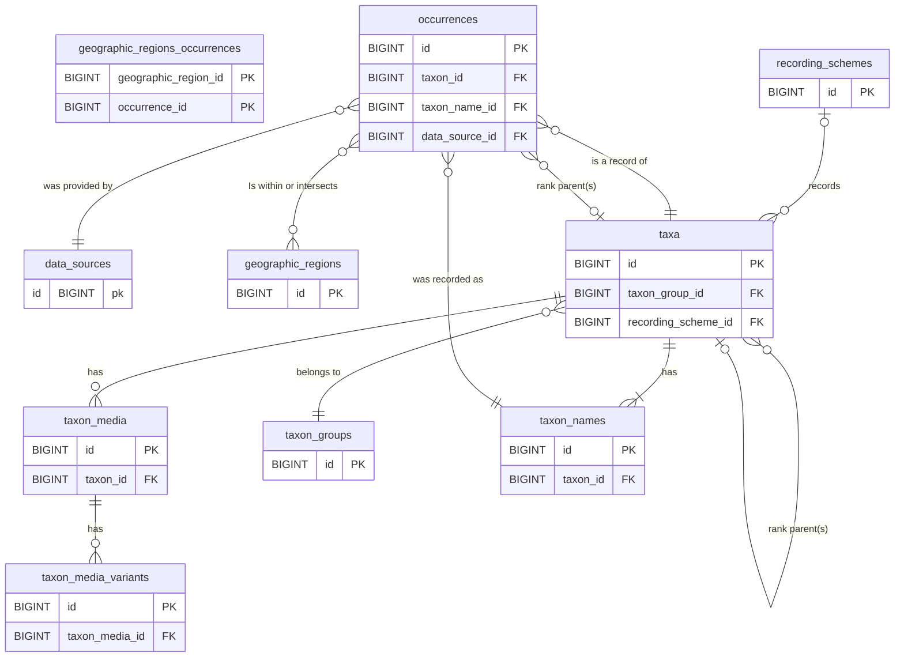

# Database schema

The Tanhub database is an intentionally simplified representation of species and observation data
optimised for reporting outputs rather than accurate storage of raw data.

The data schema is designed to use Darwin Core standards where possible, with consideration for
importing data from the UKSI species database. Fields that map directly to a property in the Darwin
Core specification are indicated by DwC followed by the Darwin Core property name.

Each data entity that is exposed to the API has a unique field associated with it that is exposed
via the API - this will be a Darwin Core field where possible, or a uuid field is added where using
an existing Darwin Core field is not feasible.

## Entity Relationship Diagram

## Dynamic taxon rank foreign keys

Taxonomic hierarchy is stored using dynamic foreign-key columns on both the `taxa` and
`occurrences` tables. During installation, a column is added for each configured taxon rank using
the pattern `<rank>_id` (for example `kingdom_id`, `class_id`, `family_id`, `order_id`).

Each of these columns is a foreign key to `taxa.id`, so rank relationships are modelled as
self-references to the `taxa` table rather than separate`orders`, `superfamilies`, or `families`
tables.

## Unprocessed data table details

The following data tables contain the unprocessed raw data imported into TanHub.

### data_sources

Lookup table for names of data sources such as iRecord and the NBN Atlas.

| Column | Type         | Null | Key | Default        | Description                                                           |
| ------ | ------------ | ---- | --- | -------------- | --------------------------------------------------------------------- |
| id     | BIGINT       | NO   | PK  | AUTO_INCREMENT | Primary key                                                           |
| abbr   | VARCHAR(10)  | NO   | UQ  |                | A unique one-word abbreviation for the data source, e..g NBN, iRecord |
| title  | VARCHAR(100) | NO   | UQ  |                | Name of the source of records, e.g. NBN Atlas or iRecord              |
| url    | VARCHAR(100) | NO   |     |                | Associated website URL                                                |

### geographic_regions

Lists the regions which define the geographical constraint of the data held in the system.
Populated using the `.env` file's `import.geographicRegions` and
`import.geographicRegionLocationType` configurations from the Indicia database.

| Column                      | Type         | Null | Key | Default           | Description                                                               |
| --------------------------- | ------------ | ---- | --- | ----------------- | ------------------------------------------------------------------------- |
| id                          | BIGINT       | NO   | PK  | AUTO_INCREMENT    | Primary key                                                               |
| higher_geography_identifier | INT          | NO   | UQ  |                   | Identifier for the geographic region, e.g. a Watsonian Vice-County number |
| higher_geography            | VARCHAR(100) | NO   |     |                   | Geographic name of the region                                             |
| location_type               | VARCHAR(100) | NO   |     |                   | Name of the type of location                                              |
| footprint_geometry          | GEOMETRY     | NO   |     |                   | Footprint or boundary of the geometry in WGS8 (EPSG:4326)                 |
| data_source_id              | BIGINT       | NO   | FK  |                   | ID of the source of the data (iRecord, NBN Atlas etc)                     |
| created_at                  | DATETIME     | NO   |     | CURRENT_TIMESTAMP | Creation date                                                             |
| updated_at                  | DATETIME     | YES  |     |                   | Update date                                                               |
| deleted_at                  | DATETIME     | YES  |     |                   | Deletion date                                                             |

### geographic_regions_occurrences

Join table linking occurrences to the regions they were recorded in. Typically
contains a single region per occurrence but may contain multiple if occurrences
overlap region boundaries.

| Column               | Type   | Null | Key    | Default | Description                                                |
| -------------------- | ------ | ---- | ------ | ------- | ---------------------------------------------------------- |
| geographic_region_id | BIGINT | NO   | PK, FK |         | Compound primary key and foreign key to geographic regions |
| occurrence_id        | BIGINT | NO   | PK, FK |         | Compound primary key and foreign key to occurrences        |

### occurrences

Occurrence data stored in the system, imported from a source such as iRecord or the NBN Atlas. A
reference to the original record is held in the unique_key field, constructed from the data_source
abbreviation, then a colon, then the unique ID of the record as loaded from the remote system.

| Column                             | Type         | Null | Key | Default           | Description                                                                           |
| ---------------------------------- | ------------ | ---- | --- | ----------------- | ------------------------------------------------------------------------------------- |
| id                                 | BIGINT       | NO   | PK  | AUTO_INCREMENT    | Primary key                                                                           |
| unique_key                         | VARCHAR(100) | NO   | UQ  |                   | Unique key for the API                                                                |
| taxon_id                           | BIGINT       | NO   | FK  |                   | ID of the taxon this is a record of                                                   |
| <rank>_id                          | BIGINT       | YES  | FK  |                   | Dynamic taxon-rank FK (for each configured rank), references `taxa.id`                |
| taxon_name_id                      | BIGINT       | NO   | FK  |                   | ID of the name given for this occurrence which may be accepted, synonym or vernacular |
| from_date                          | DATE         | YES  |     |                   | Start of the date range that covers the record                                        |
| to_date                            | DATE         | YES  |     |                   | End of the date range that covers the record                                          |
| grid_ref                           | VARCHAR(20)  | NO   |     |                   | OSGB grid reference                                                                   |
| grid_ref_2km                       | CHAR(5)      | YES  |     |                   | 2km (DINTY) grid ref that best fits the record, null for less precise records         |
| locality                           | VARCHAR(255) | YES  |     |                   | Site name associated with the record                                                  |
| recorded_by                        | VARCHAR(255) | NO   |     |                   | Name of the person or agent that recorded the occurrence                              |
| identified_by                      | VARCHAR(255) | YES  |     |                   | Name of person or agent that made the identification                                  |
| identification_verification_status | VARCHAR(2)   | NO   |     |                   | Verification status code, compatible with iRecord codes                               |
| sex                                | VARCHAR(20)  | YES  |     |                   | Sex of the organism if known                                                          |
| life_stage                         | VARCHAR(20)  | YES  |     |                   | Life stage of the organism if known                                                   |
| organism_quantity                  | VARCHAR(20)  | YES  |     |                   | A number or enumeration value for the quantity of organisms                           |
| data_source_id                     | BIGINT       | NO   | FK  |                   | ID of the source of the data (iRecord, NBN Atlas etc)                                 |
| blocked                            | TINYINT(1)   | NO   |     |                   | 1 = occurrence is blocked from reports, 0 otherwise                                   |
| blocked_reason                     | TEXT         | YES  |     |                   | Reason given for blocking the record                                                  |
| created_at                         | DATETIME     | NO   |     | CURRENT_TIMESTAMP | Creation date                                                                         |
| updated_at                         | DATETIME     | YES  |     |                   | Update date                                                                           |
| deleted_at                         | DATETIME     | YES  |     |                   | Deletion date                                                                         |

### recording_schemes

Recording schemes associated with taxa loaded in the system.

| Column       | Type         | Null | Key | Default           | Description                                                                                                   |
| ------------ | ------------ | ---- | --- | ----------------- | ------------------------------------------------------------------------------------------------------------- |
| id           | BIGINT       | NO   | PK  | AUTO_INCREMENT    | Primary key                                                                                                   |
| external_key | CHAR(16)     | NO   | UQ  |                   | Key for the scheme as assigned from the external database the data were imported from, unique key for the API |
| title        | VARCHAR(100) | NO   |     |                   | Title of the scheme                                                                                           |
| created_at   | DATETIME     | NO   |     | CURRENT_TIMESTAMP | Creation date                                                                                                 |
| updated_at   | DATETIME     | YES  |     |                   | Update date                                                                                                   |
| deleted_at   | DATETIME     | YES  |     |                   | Deletion date                                                                                                 |

### taxa

Details of species concepts. May also contain other reportable taxonomic levels (e.g. aggregates).
Taxa are generally imported but species account text may be added locally. Where a field maps
directly to a Darwin Core concept, this is indicated in the description.

| Column                     | Type         | Null | Key | Default           | Description                                                            |
| -------------------------- | ------------ | ---- | --- | ----------------- | ---------------------------------------------------------------------- |
| id                         | BIGINT       | NO   | PK  | AUTO_INCREMENT    | Primary key                                                            |
| taxon_identifier           | VARCHAR(100) | NO   | UQ  |                   | Taxon identifier, DwC taxonID, Unique key for the API.                 |
| scientific_name_identifier | VARCHAR(100) | NO   |     |                   | Unique identifier of the accepted name, DwC scientificNameID           |
| scientific_name            | VARCHAR(200) | NO   |     |                   | Accepted scientific taxon name, DwC scientificName                     |
| scientific_name_authorship | VARCHAR(100) | YES  |     |                   | Taxon name author, DwC scientificNameAuthorship                        |
| vernacular_name            | VARCHAR(200) | NO   |     |                   | Common taxon name, DwC vernacularName                                  |
| <rank>_id                  | BIGINT       | YES  | FK  |                   | Dynamic taxon-rank FK (for each configured rank), references `taxa.id` |
| taxon_group_id             | BIGINT       | NO   | FK  |                   | ID of the taxon reporting group                                        |
| id_difficulty              | TINYINT      | YES  |     |                   | Record Cleaner ID difficulty (1-5)                                     |
| recording_scheme_id        | BIGINT       | YES  | FK  |                   | ID of the associated recording scheme                                  |
| conservation_status        | VARCHAR(10)  | YES  |     |                   | Abbreviation of the taxon's conservation designation                   |
| taxon_remarks              | TEXT         | YES  |     |                   | Species account text if provided, DwC taxonRemarks                     |
| rarity_group_name          | VARCHAR(100) | NO   |     |                   |                                                                        |
| blocked                    | TINYINT(1)   | NO   |     |                   | 1 = species is blocked from searches, 0 otherwise                      |
| blocked_reason             | TEXT         | YES  |     |                   | Reason given for blocking the record                                   |
| created_at                 | DATETIME     | NO   |     | CURRENT_TIMESTAMP | Creation date                                                          |
| updated_at                 | DATETIME     | YES  |     |                   | Update date                                                            |
| deleted_at                 | DATETIME     | YES  |     |                   | Deletion date                                                          |

Note that when TanHub is linked to UKSI as its source of taxonomic data, the following applies:
- taxon_identifier will contain `ORGANISM_KEY`, the UKSI provided unique identifier of the organism
  and unique ID for the API.
- scientific_name_identifier will contain the unique identifier of the accepted taxon name, the
  `TAXON_VERSION_KEY`.
- conservation_status will hold the GB Red List designation's abbreviation, e.g. LC or VU.

### taxon_media

Uploaded media assets attached to a taxon. The `storage_path` is relative to
`writable/uploads/taxon-media` and `uuid` is the stable identifier used by media delivery URLs.

| Column            | Type         | Null | Key | Default           | Description                                      |
| ----------------- | ------------ | ---- | --- | ----------------- | ------------------------------------------------ |
| id                | BIGINT       | NO   | PK  | AUTO_INCREMENT    | Primary key                                      |
| uuid              | CHAR(36)     | NO   | UQ  |                   | Stable media identifier used in delivery routes  |
| taxon_id          | BIGINT       | NO   | FK  |                   | Foreign key to `taxa.id`                         |
| original_filename | VARCHAR(255) | NO   |     |                   | Original client filename                         |
| storage_path      | VARCHAR(255) | NO   |     |                   | Relative path to stored original image           |
| mime_type         | VARCHAR(100) | NO   |     |                   | Uploaded MIME type                               |
| bytes             | INT          | NO   |     |                   | File size in bytes                               |
| width             | INT          | YES  |     |                   | Pixel width (if detected)                        |
| height            | INT          | YES  |     |                   | Pixel height (if detected)                       |
| alt_text          | TEXT         | YES  |     |                   | Accessibility alt text                           |
| caption           | TEXT         | YES  |     |                   | Optional public caption                          |
| attribution       | VARCHAR(255) | YES  |     |                   | Attribution/credit text                          |
| license           | VARCHAR(100) | YES  |     |                   | License label                                    |
| sort_order        | INT          | NO   |     | 0                 | Display ordering within a taxon                  |
| is_primary        | TINYINT(1)   | NO   |     | 0                 | 1 if primary image for a taxon, otherwise 0      |
| created_at        | DATETIME     | NO   |     | CURRENT_TIMESTAMP | Creation date                                    |
| updated_at        | DATETIME     | YES  |     |                   | Update date                                      |
| deleted_at        | DATETIME     | YES  |     |                   | Soft delete date                                 |

Indexes and constraints:

- Unique index on `uuid`.
- Index on `taxon_id`.
- Composite index on `taxon_id, sort_order`.
- FK `taxon_id` references `taxa.id` with cascade delete.

### taxon_media_variants

Derived image sizes for each row in `taxon_media` (for example `thumbnail` and `large`).

| Column         | Type         | Null | Key    | Default        | Description                                      |
| -------------- | ------------ | ---- | ------ | -------------- | ------------------------------------------------ |
| id             | BIGINT       | NO   | PK     | AUTO_INCREMENT | Primary key                                      |
| taxon_media_id | BIGINT       | NO   | FK, UQ*|                | FK to `taxon_media.id`                           |
| variant_key    | VARCHAR(50)  | NO   | UQ*    |                | Variant name, e.g. `thumbnail`, `large`         |
| storage_path   | VARCHAR(255) | NO   |        |                | Relative path to derived file                    |
| mime_type      | VARCHAR(100) | NO   |        |                | MIME type of the derived file                    |
| bytes          | INT          | NO   |        |                | File size in bytes                               |
| width          | INT          | YES  |        |                | Pixel width of derived file                      |
| height         | INT          | YES  |        |                | Pixel height of derived file                     |
| created_at     | DATETIME     | NO   |        | CURRENT_TIMESTAMP | Creation date                                 |

UQ* indicates a composite unique index across `taxon_media_id` and `variant_key`.

Additional constraints:

- Index on `taxon_media_id`.
- FK `taxon_media_id` references `taxon_media.id` with cascade delete.

### taxon_groups

Taxon reporting categories. The friendly field allows a local override for taxon groups imported
from other databases such as UKSI. Groups covered by this installation of TanHub are defined in
configuration.

| Column                 | Type         | Null | Key | Default           | Description                                                                                                  |
| ---------------------- | ------------ | ---- | --- | ----------------- | ------------------------------------------------------------------------------------------------------------ |
| id                     | BIGINT       | NO   | PK  | AUTO_INCREMENT    | Primary key                                                                                                  |
| title                  | VARCHAR(200) | NO   |     |                   | Official taxon group name                                                                                    |
| friendly               | VARCHAR(200) | YES  |     |                   | Friendly version of the taxon group name                                                                     |
| external_key           | VARCHAR(100) | YES  | UQ  |                   | Key for the group as assigned from the external database the data were imported from, unique key for the API |
| indicia_taxon_group_id | BIGINT       | NO   | UQ  |                   | ID of the group from the Indicia database, used to make import from Indicia more efficient and robust        |
| implied                | TINYINT(1)   | NO   |     | 0                 | Boolean flag supplied by import source to indicate the group is implied                                       |
| created_at             | DATETIME     | NO   |     | CURRENT_TIMESTAMP | Creation date                                                                                                |
| updated_at             | DATETIME     | YES  |     |                   | Update date                                                                                                  |
| deleted_at             | DATETIME     | YES  |     |                   | Deletion date                                                                                                |

### taxon_ranks

Taxonomic ranks such as Species, Family, Order. Ranks covered by this installation of TanHub are
defined in configuration.

| Column     | Type        | Null | Key | Default           | Description                              |
| ---------- | ----------- | ---- | --- | ----------------- | ---------------------------------------- |
| id         | BIGINT      | NO   | PK  | AUTO_INCREMENT    | Primary key                              |
| rank       | VARCHAR(50) | NO   | UQ  |                   | Taxon rank name                          |
| abbr       | VARCHAR(10) | NO   | UQ  |                   | Abbreviation, e.g. sp, fam, ord.         |
| sort_order | INT         | NO   |     |                   | Sort ranks by taxonomic hierarchy level. |
| created_at | DATETIME    | NO   |     | CURRENT_TIMESTAMP | Creation date                            |
| updated_at | DATETIME    | YES  |     |                   | Update date                              |
| deleted_at | DATETIME    | YES  |     |                   | Deletion date                            |

### taxon_names

Provides a full list of species and other taxon names that are searchable when finding a concept
for reporting. This includes accepted scientific names, common (vernacular) names and synonyms.
Where a field maps directly to a Darwin Core concept, this is indicated in the description. Note
that scientific_name_identifier is not necessarily unique in this instance as one name can be
attached to more than one taxonomic concept, in this data schema we duplicate the name records for
simplicity as this avoids the need for an additional join table.

| Column                     | Type         | Null | Key     | Default           | Description                                                                      |
| -------------------------- | ------------ | ---- | ------- | ----------------- | -------------------------------------------------------------------------------- |
| id                         | BIGINT       | NO   | PK      | AUTO_INCREMENT    | Primary key                                                                      |
| uuid                       | CHAR(36)     | NO   | UQ      |                   | Unique key for the API                                                           |
| taxon_id                   | BIGINT       | NO   | FK, UQ* |                   | Foreign key to the taxon this name is associated with                            |
| name                       | VARCHAR(200) | NO   |         |                   | Taxon name, DwC scientificName                                                   |
| scientific_name_identifier | VARCHAR(100) | NO   | UQ*     |                   | Unique identifier of the nomenclatural details of the name, DwC scientificNameID |
| accepted                   | TINYINT(1)   | NO   |         |                   | Is name accepted                                                                 |
| scientific                 | TINYINT(1)   | NO   |         |                   | 1=scientific, 0=vernacular                                                       |
| created_at                 | DATETIME     | NO   |         | CURRENT_TIMESTAMP | Creation date                                                                    |
| updated_at                 | DATETIME     | YES  |         |                   | Update date                                                                      |
| deleted_at                 | DATETIME     | YES  |         |                   | Deletion date                                                                    |

* `UQ*` indicates a compound unique index across
  `taxon_id, scientific_name_identifier`.

Note that when TanHub is linked to UKSI as its source of taxonomic data, the following applies:
- scientific_name_identifier will contain the unique identifier of this taxon name, the
  `TAXON_VERSION_KEY`.

## Processed data table details

The following tables contain processed data designed to make reporting outputs easier to build and
more efficient to run.

### grid_square_stats

Statistics for 2km grid squares. Where a grid square intersects 2 or more region boundaries, there
will be a copy of the grid square per region (with partial set to true). The number of records and
species will pertain to the portion of the grid square inside that VC. There will also be a copy
with the geographic_region_id null and partial set to false. Therefore, a query for all grid
squares should filter on partial=false. A query on a given geographic_region_id can filter on the
geographic_region_id alone (this will include contained grid squares, plus those along the boundary
where partial is true).

| Column               | Type        | Null | Key     | Default        | Description                                                                                          |
| -------------------- | ----------- | ---- | ------- | -------------- | ---------------------------------------------------------------------------------------------------- |
| id                   | BIGINT      | NO   | PK      | AUTO_INCREMENT | Primary key                                                                                          |
| uuid                 | CHAR(36)    | NO   | UQ      |                | Unique key for the API                                                                               |
| square               | VARCHAR(12) | NO   | UQ*     |                | Grid square in OSGB notation                                                                         |
| geographic_region_id | BIGINT      | NO   | FK, UQ* |                | Geographic region this square belongs to                                                             |
| easting              | INT         | NO   |         |                | Grid square centroid easting in metres (OSGB:1936)                                                   |
| northing             | INT         | NO   |         |                | Grid square centroid northing in metres (OSGB:1936)                                                  |
| partial              | BOOL        | NO   |         | false          | Flag set to true if the square is only partially within the region, so this is not the entire square |
| occurrences_count    | INT         | NO   |         |                | Number of occurrences which intersect the grid square                                                |
| species_count        | INT         | NO   |         |                | Number of species which intersect the grid square                                                    |

UQ* indicates a compound unique index on `square` and `geographic_region_id` so
they cannot be duplicated.

### taxon_stats

A table with statistics for each taxon, both in the context of a region and across all regions.
Contains a row per taxon for the full dataset, plus a row per taxon per region, so it is easy to
access stats across the dataset or region filtered.

| Column                     | Type         | Null | Key     | Default        | Description                                                                            |
| -------------------------- | ------------ | ---- | ------- | -------------- | -------------------------------------------------------------------------------------- |
| id                         | BIGINT       | NO   | PK      | AUTO_INCREMENT | Primary key                                                                            |
| uuid                       | CHAR(36)     | NO   | UQ      |                | Unique key for the API                                                                 |
| taxon_id                   | BIGINT       | NO   | FK, UQ* |                | Foreign key to the taxon                                                               |
| geographic_region_id       | BIGINT       | YES  | FK, UQ* |                | Region, or null if applies to all regions                                              |
| occurrences_count          | INT          | NO   |         |                | Number of occurrences for the taxon/year combination                                   |
| grid_square_count          | INT          | NO   |         |                | Number of grid squares for the taxon/year combination                                  |
| first_record_date          | DATE         | NO   |         |                | Date of the first record of this taxon (in the region or across all)                   |
| last_record_date           | DATE         | NO   |         |                | Date of the last record of this taxon (in the region or across all)                    |
| first_recorder             | VARCHAR(255) | NO   |         |                | Recorder name of the first record of this taxon (in the region or across all)          |
| last_recorder              | VARCHAR(255) | NO   |         |                | Recorder name of the last record of this taxon (in the region or across all)           |
| first_verified_record_date | DATE         | NO   |         |                | Date of the first verified record of this taxon (in the region or across all)          |
| last_verified_record_date  | DATE         | NO   |         |                | Date of the last verified record of this taxon (in the region or across all)           |
| first_verified_recorder    | VARCHAR(255) | NO   |         |                | Recorder name of the first verified record of this taxon (in the region or across all) |
| last_verified_recorder     | VARCHAR(255) | NO   |         |                | Recorder name of the last verified record of this taxon (in the region or across all)  |

### taxon_year_stats

Containing data for each taxon covering the last 10 years, both across all data and broken down by
region.

| Column               | Type     | Null | Key     | Default        | Description                                           |
| -------------------- | -------- | ---- | ------- | -------------- | ----------------------------------------------------- |
| id                   | BIGINT   | NO   | PK      | AUTO_INCREMENT | Primary key                                           |
| uuid                 | CHAR(36) | NO   | UQ      |                | Unique key for the API                                |
| taxon_id             | BIGINT   | NO   | FK, UQ* |                | Foreign key to the taxon                              |
| geographic_region_id | BIGINT   | YES  | FK, UQ* |                | Region, or null if applies to all regions             |
| year                 | INT      | NO   | UQ*     |                | Year the statistics apply to                          |
| occurrences_count    | INT      | NO   |         |                | Number of occurrences for the taxon/year combination  |
| grid_square_count    | INT      | NO   |         |                | Number of grid squares for the taxon/year combination |

UQ* indicates there is a compound unique key on `taxon_id`, `geographic_region_id` and `year`.
